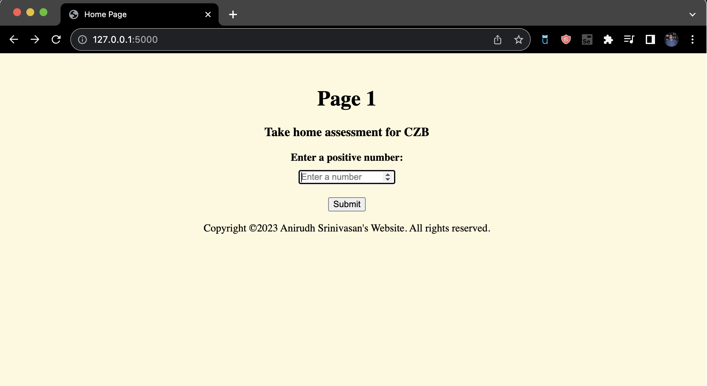

# Fibonacci_Full_stack
Full stack project built for CZB take home assessment
The frontend has 2 pages namely
1. home.html - we have a label, textbox and a submit button encompassed inside a
2. final.html -  displays the output we calculate

On the backend we peroform a few functions
1. Initialize a database abd create a table.
2. Peform a calculation based on input recieved in the frontend.
3. Query from the database if the entered number alrady exists in the table.
4. Display the output on the frontend.

Walkthrough of the project
1. Homepage

