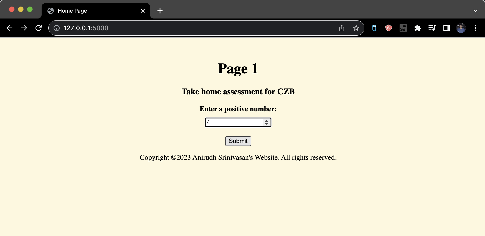
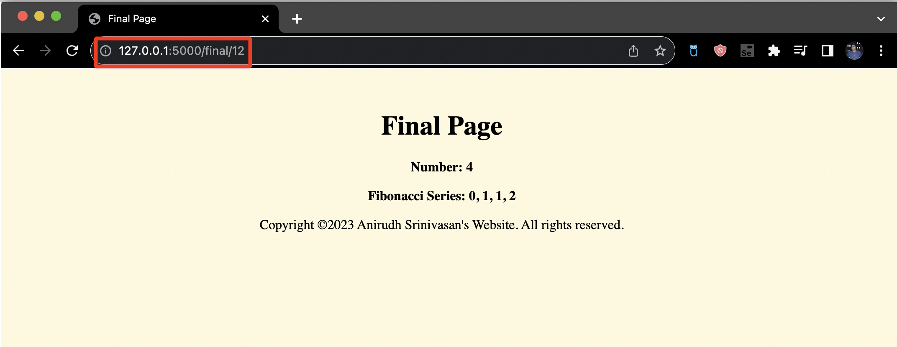
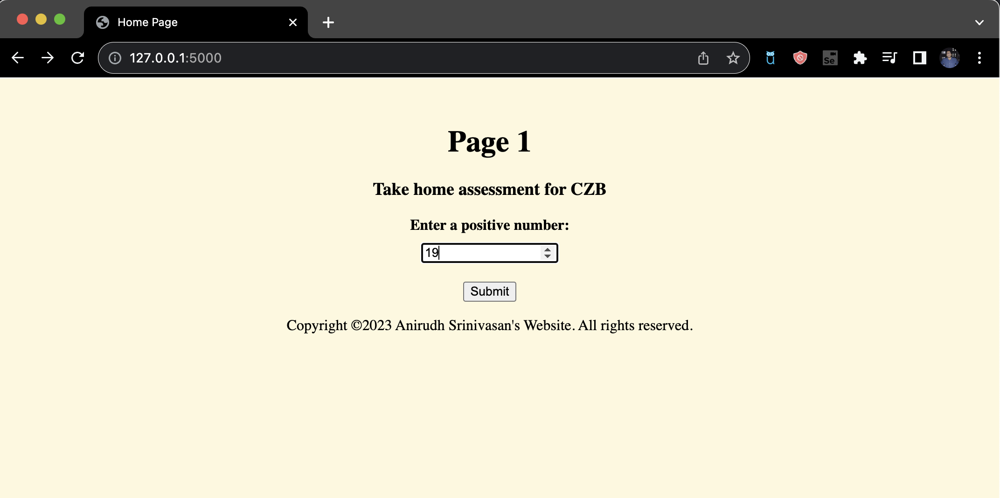
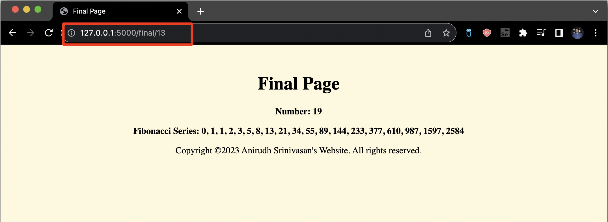
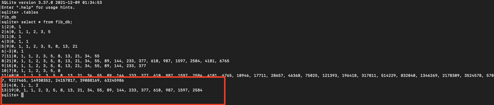

# Fibonacci Full-stack 
Full stack project built for CZB take home assessment
The frontend has 2 pages namely
1. home.html - we have a label, textbox and a submit button encompassed inside a
2. final.html -  displays the output we calculate

On the backend we peroform a few functions
1. Initialize a database abd create a table.
2. Peform a calculation based on input recieved in the frontend.
3. Query from the database if the entered number alrady exists in the table.
4. Display the output on the frontend.

Walkthrough of the project
1. Homepage

2. Giving an input of 4 on the main page.

3. Output for 4 on the final page.
Observe the number(12), this is the ID(primary key of our table) in the link (highlighted in red).

4. Giving an input of 19 on the main page.

5. Output for 4 on the final page.
Observe the number(13), this is the ID(primary key of our table) in the link (highlighted in red).

6. Verifying output in table stored in database
Observe the values highlighted in red.
You can clearly see the 12th and 13th entry.

